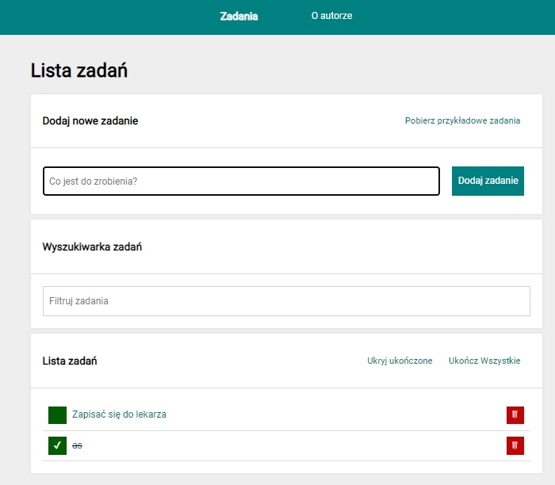
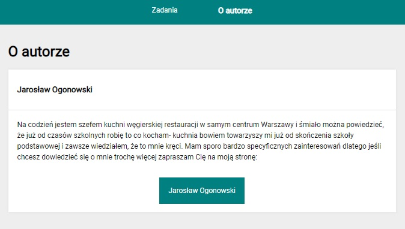
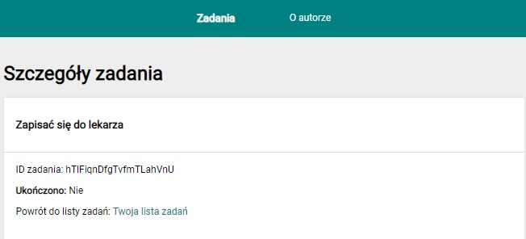
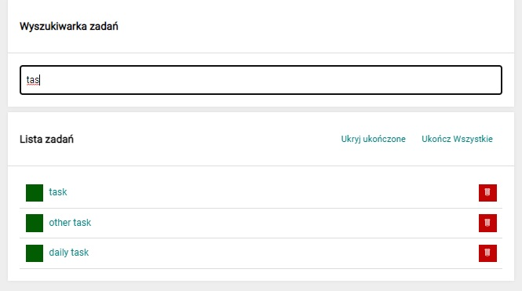

# Task List- react

Demo: https://jaroslawogonowski.github.io/Task-List--react/

The project was created during the frontend course with the participation of the youcode school,
during the earlier stages, one of the tasks was to recreate the appearance and functionality of the website based only on its appearance shown in the video.

Now it's time to move the project into the new fascinating world of React.

Previous version running on html, js and css available here:
https://jaroslawogonowski.github.io/task-list/

## Features

- Create react app
- React-router-dom

- useHistory, useLocation

- ES6 (arrow function, promises)
- nanoId
- useDispatch, useSelector
- useRef, useState, useEffect
- @reduxjs/toolkit (state, configureStore)
- styled-components
- @redux-saga
- async, await
- fetch
- local storage